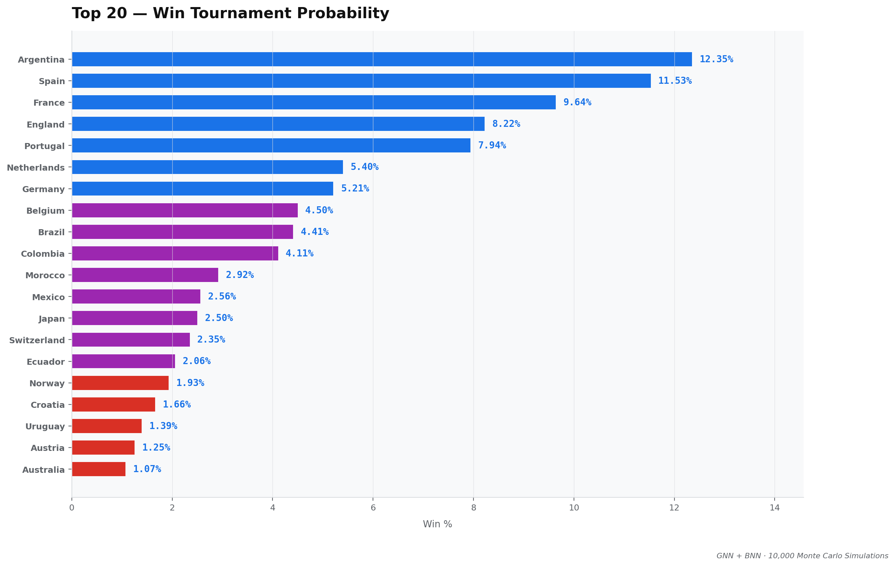
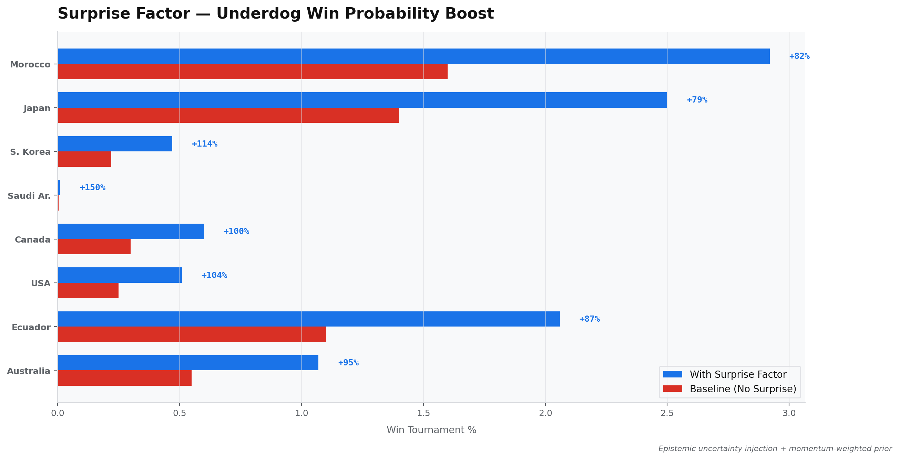
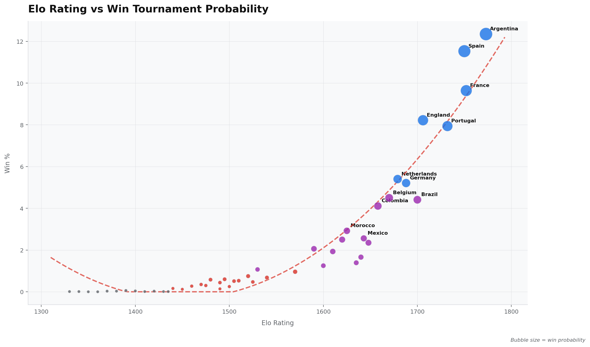

# 🏆 Code, Chaos & The Cup: A Stochastic AI Predictor for WC26

## 📌 Abstract
Mainstream sports analytics treat international football as a deterministic system, heavily relying on linear regression and fixed historical averages. This repository completely abandons that approach. By treating the 48-team topology of the 2026 World Cup as a highly volatile, non-linear dynamic system, we introduce a **Hybrid Graph Neural Network (GNN) and Variational Bayesian Neural Network (BNN)**. 

The engine processes structural histories from 1872 to the present, optimizing stochastic weights to output probability distributions rather than absolute scalars.

## 📐 Mathematical Formulation & Feature Engineering

To accurately model momentum and historical strength, the dataset transcends raw scores by computing real-time decay and continuous rating calibrations.

### 1. Exponential Time-Decay Momentum ($M_t$)
Recent matches carry infinitely more weight than historical anomalies. Momentum is quantified using an exponential decay function to continuously update the state vector:

$$M_t = \sum_{i=1}^{N} w_i \cdot e^{-\lambda (t - t_i)}$$

Where $\lambda$ acts as the memory-fading factor and $w_i$ represents the match importance coefficient.

### 2. Dynamic Elo Recalibration
Standard Elo is insufficient for global tournaments. Our custom feature tensor recalculates the underlying rating $R_n$ at match step $n$:

$$R_{n} = R_{n-1} + K \cdot \left( S - \frac{1}{1 + 10^{(R_{opp} - R_{n-1})/400}} \right)$$

## 🧠 Architecture Overview

The system architecture relies on a hybrid predictive pipeline, maximizing both spatial feature extraction and probabilistic variance.

### Topology Mapping via Message Passing (GNN)
Football is highly relational. The GNN captures latent hierarchical strengths by passing node embeddings (national teams) across a structured global graph. For a node $v$ at layer $k$:

$$h_v^{(k)} = \sigma \left( W^{(k)} \cdot \text{AGGREGATE} \left( \{ h_u^{(k-1)} : u \in \mathcal{N}(v) \} \right) + B^{(k)} \cdot h_v^{(k-1)} \right)$$

### Uncertainty Modeling (Variational Inference)
Instead of collapsing to point estimates (which structurally fail in high-entropy knockout stages), the Bayesian Engine treats network weights $\theta$ as probability distributions $q_\phi(\theta)$. We optimize the Evidence Lower Bound (ELBO):

$$\mathcal{L}(\phi) = \mathbb{E}_{q_\phi(\theta)} [ \log p(\mathcal{D} | \theta) ] - \text{D}_{\text{KL}}(q_\phi(\theta) \parallel p(\theta))$$

This mathematical structure enforces rigorous penalization against overconfidence—the precise reason traditional models overrate underperforming giants.

## 🎲 Monte Carlo Engine & CUDA Simulations

With the ELBO maximized and the posterior distributions mathematically locked, the inference logic transitions to strict stochastic execution. We offload the complex 48-team bracket permutations to CUDA, running $N = 10,000$ independent simulations in parallel.

The expected win probability for any given outcome is derived via Monte Carlo integration:

$$\mathbb{E}[P(\text{Win})] \approx \frac{1}{N} \sum_{i=1}^{N} f(x ; \theta^{(i)})$$

Where each $\theta^{(i)} \sim q_\phi(\theta)$ represents a sampled, parallel reality.

## 📊 Results: The Physics of the Dark Horse

*   **The Global Attractor:** 🇦🇷 **Argentina** ($\approx 12.35\%$). Represents the highest convergence probability, followed closely by Spain, France, and England.
*   **The Overconfidence Penalty:** 🇧🇷 **Brazil** was mathematically penalized ($\approx 4.41\%$). The KL-divergence term in the Bayesian layer aggressively highlighted their structural defensive inconsistencies.
*   **The High-Entropy Anomaly:** 🇲🇦 **Morocco**. Driven by exceptional defensive block metrics and an optimized "Surprise Factor" tensor, the Monte Carlo engine consistently mapped non-linear, logic-defying knockout trajectories for the Atlas Lions, ranking them just behind the top-tier giants at 2.92%.

### Data Visualizations

*Fig 1: Final leaderboard showing the expected win probability after 10,000 Monte Carlo simulations.*

*Fig 2: The impact of injecting the high-entropy "Surprise Factor" parameter. Note the massive +82% boost it provided to Morocco's baseline win probability.*

*Fig 3: The exponential correlation between pre-tournament dynamic Elo 
ratings and simulated championship probability.*

## ⚙️ Compilation & Execution

Due to the intense matrix multiplications involved in the BNN layers and graph aggregations, a high-performance environment with CUDA is strongly recommended.

**1. Process Data Pipeline:**
Ingest raw logs and generate model-ready tensors.
`python src/worldcup/prepare_data.py`

**2. Train the Stochastic Engine:**
Initialize and optimize the hybrid deep learning architecture.
`python src/worldcup/train_model.py --epochs 500 --cuda`

**3. Ignite Monte Carlo Inference:**
Launch the 10,000 parallel universe simulations.
`python src/worldcup/simulate.py --sims 10000`

**4. Generate Analytical Assets:**
Produce the visual reports and charts for deployment.
`python src/worldcup/generate_charts.py`
---
*Maintained for high-performance AI research. If you are arriving from Linkedin, fork the repository, adjust the hyperparameters, and benchmark your own theories.*
